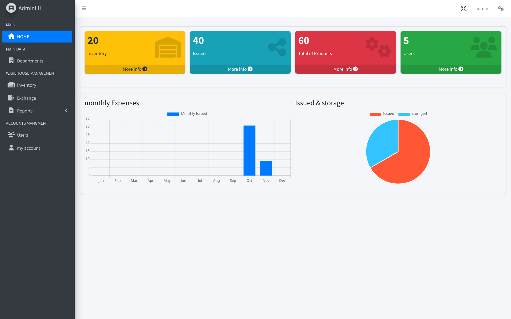
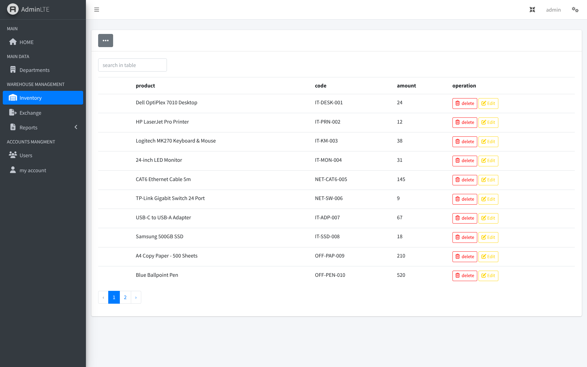
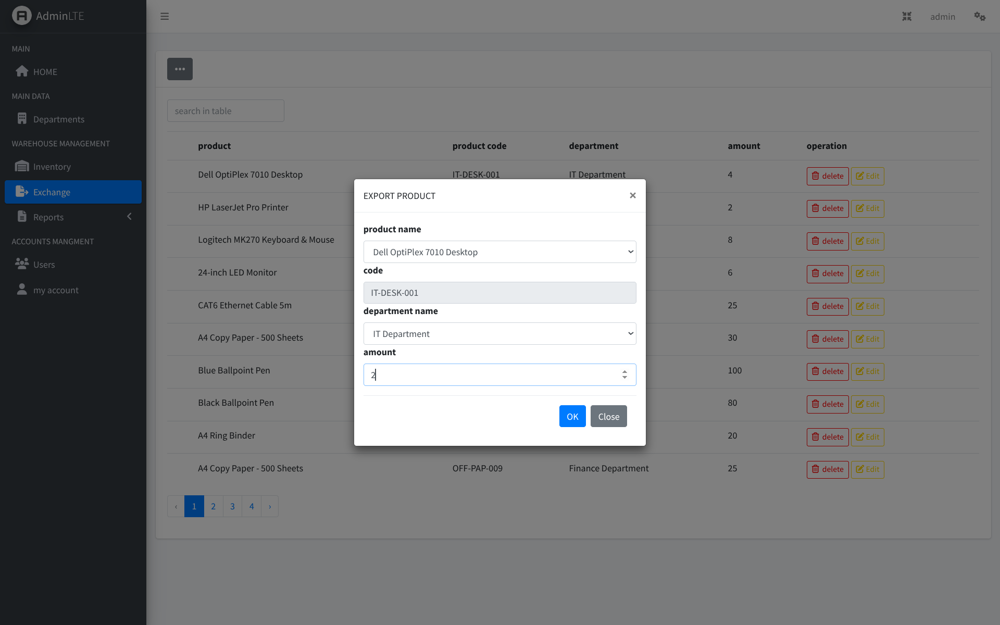
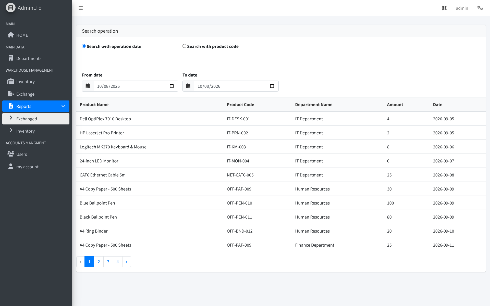

# Inventory & Storage Management System

An early Laravel project focused on inventory and storage management. It handles products, quantities, categories, departments, stock movement, users, reports, and related calculations — one of the projects that helped build a strong foundation in Laravel, Eloquent, relational databases, authentication, and business logic. It represents an earlier stage of the development journey rather than the current architecture style.

---

## Overview

Managing warehouse inventory and tracking stock exchanges between different departments is a crucial operational requirement for organizations. 

This system provides a centralized platform to manage:
- **Inventory Stock:** Monitoring current product quantities, item codes, and stock levels.
- **Stock Movement (Exchange):** Handling product distribution, issuing items to various departments, and managing quantities seamlessly.
- **Reporting & Filtering:** Inspecting historical operations, tracking stock movement by date ranges or product codes, and generating administrative insights.
- **User Authentication & Control:** Secure multi-user access backed by Laravel authentication mechanisms.

---

## Screenshots

### Dashboard


### Inventory Management


### Stock Exchange & Operations


### Reports & Analytics


---

## Features

### Inventory & Stock Tracking
- Comprehensive management of items, including product names, unique codes, and real-time quantity tracking.
- Automated updates to stock counts upon issuing or receiving products.

### Stock Exchange / Movement
- Dedicated workflow to issue and transfer products from the main inventory to specific internal departments.
- Transaction validation ensuring sufficient stock quantities before executing export or exchange operations.

### Advanced Reports & Filtering
- Dynamic report generation system.
- Filter operations flexibly by **Operation Date** (from-date to-date ranges) or by specific **Product Codes**.

### User Management & Authentication
- Secure login and registration powered by Laravel Breeze and Sanctum.
- Role-based interaction controlling access to warehouse actions, inventory adjustments, and system reports.

---

## Architecture & Design Approach

While this project represents an earlier stage in the developer's architectural journey, it implements solid backend foundations using standard Laravel conventions:
- **Eloquent ORM:** Leveraging relational database mappings to handle complex relationships between products, departments, and stock movements.
- **Database Migrations & Seeders:** Structured schema management using clean relational database principles.
- **Request Validation:** Form Request classes are utilized to validate incoming input data securely before touching the database logic.
- **UI Integration:** Built with a clean administrative dashboard layout (AdminLTE integrated with Laravel UI/Breeze) to maximize usability and operational clarity.

---

## Technology Stack

| Technology | Purpose |
| :--- | :--- |
| **PHP 8.1+** | Backend Programming Language |
| **Laravel 10** | Core Application Framework |
| **AdminLTE / Bootstrap** | Administrative Dashboard UI Theme |
| **Laravel Breeze / UI** | Authentication Scaffolding |
| **MySQL / Relational DB** | Database Management & Relations |

---

## Project Structure

The project follows the standard expressive structure of Laravel applications, organized neatly across controllers, models, views, and migrations:

```text
app/
├── Http/
│   ├── Controllers/
│   ├── Middleware/
│   └── Requests/
├── Models/
└── ...

database/
├── migrations/
├── seeders/
└── factories/

public/
└── images/
    └── screenshots/

resources/
├── views/
└── js / css

routes/
└── web.php
